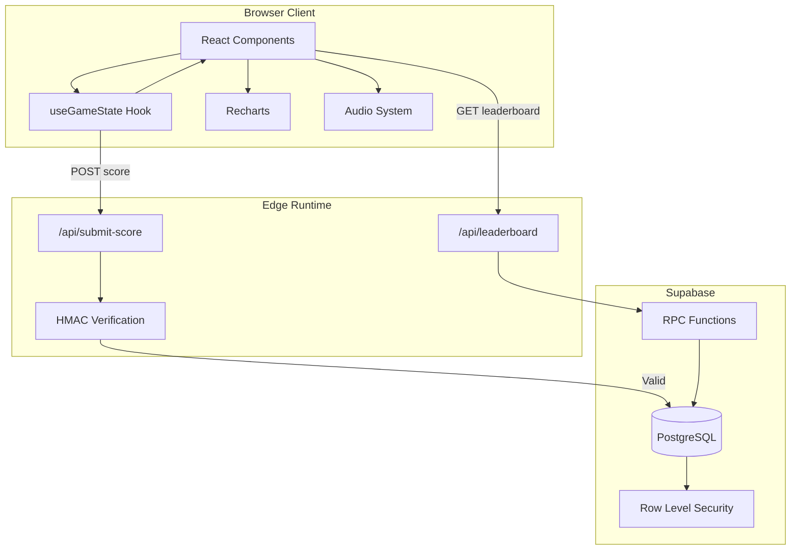
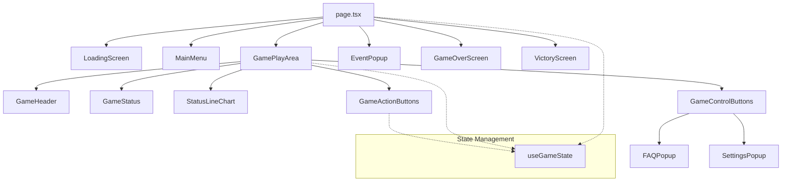
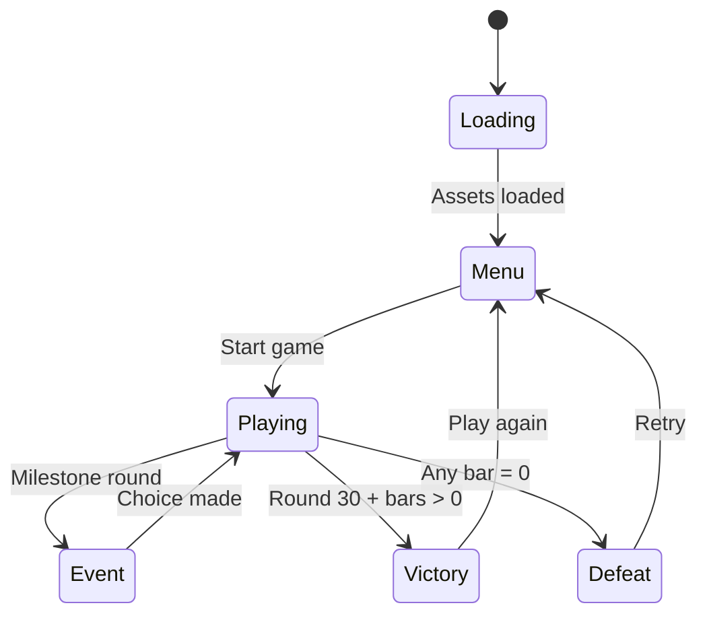
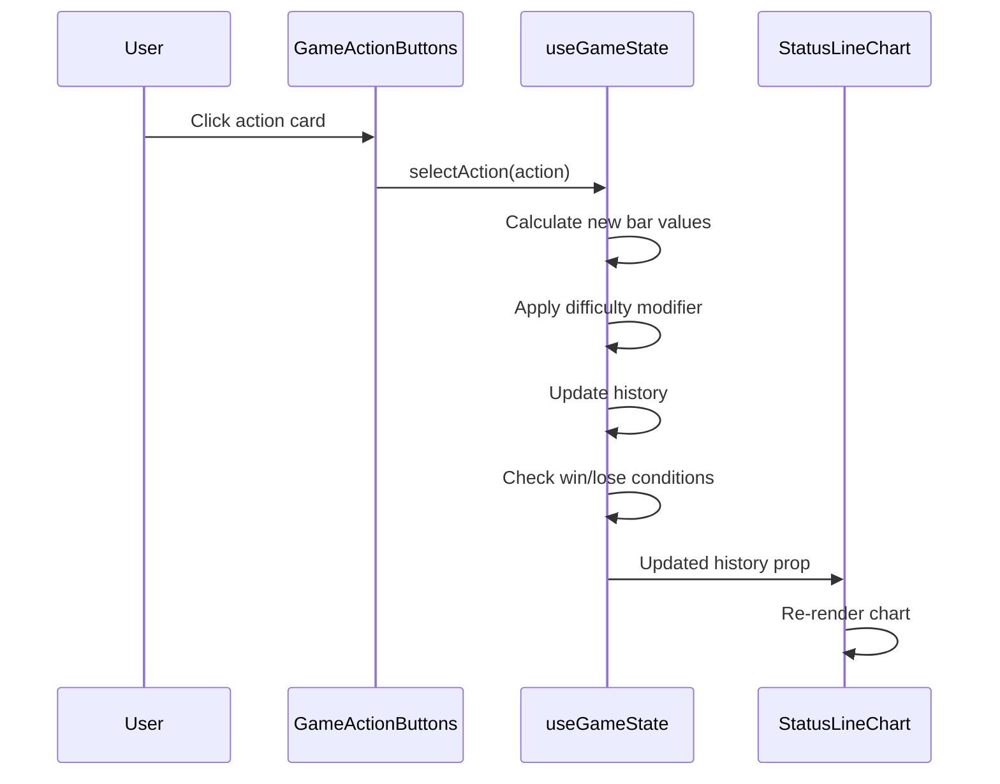
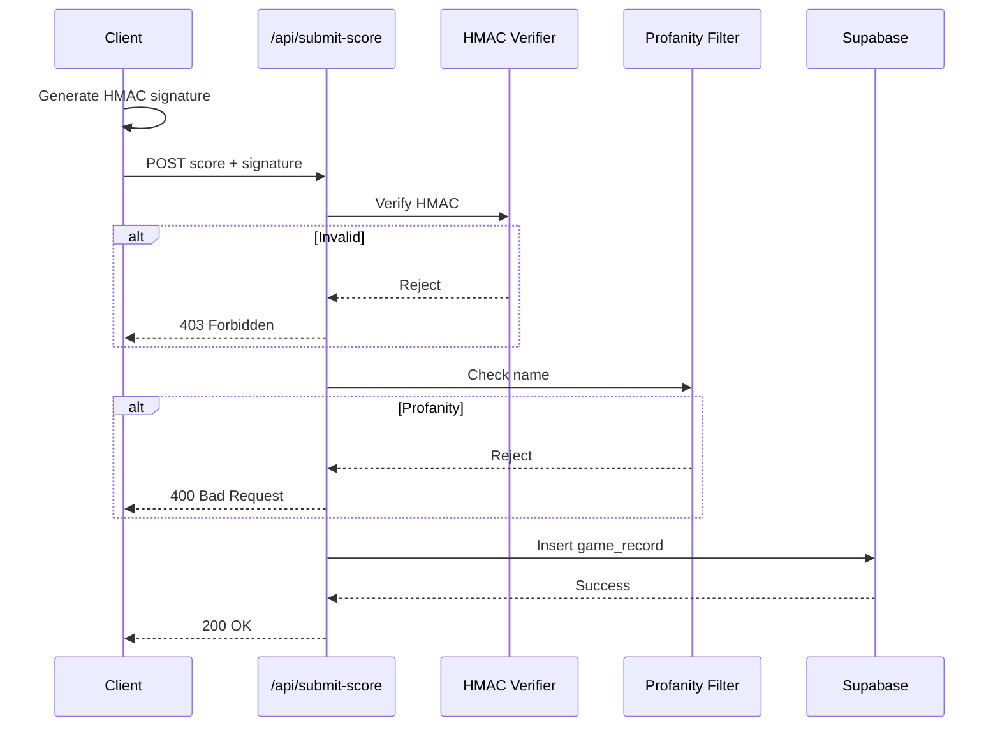
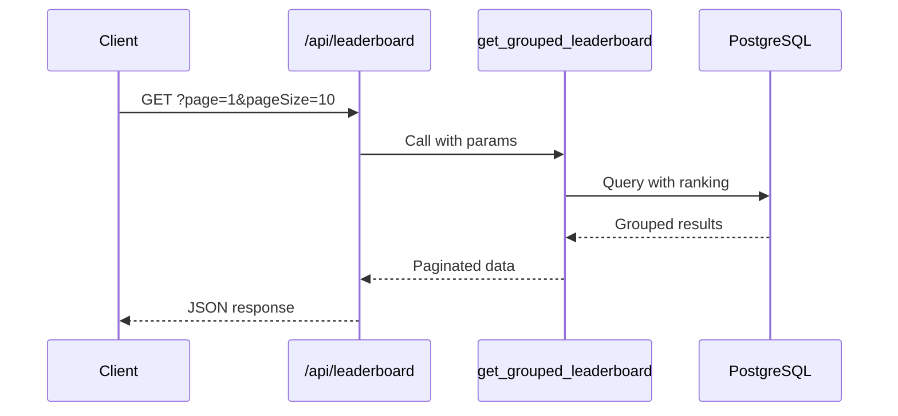
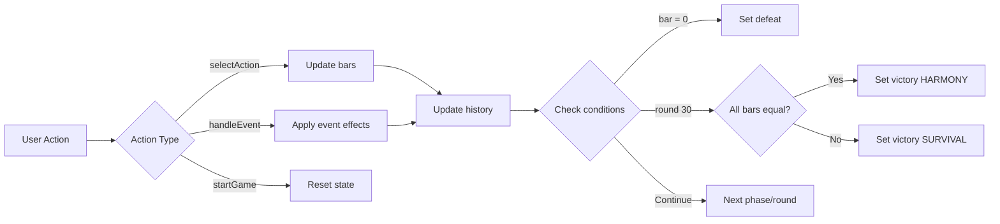
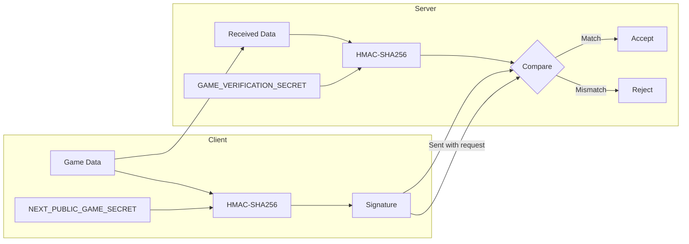
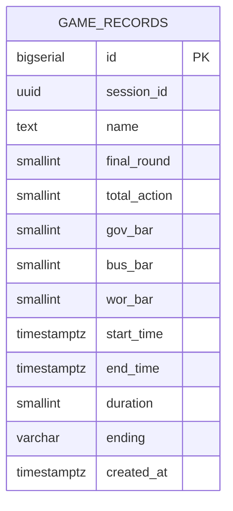

# System Architecture

> **Last Updated:** 2026-01-15  
> **Runtime:** Next.js 16 + Edge Runtime

## Table of Contents

- [High-Level Architecture](#high-level-architecture)
- [Component Architecture](#component-architecture)
- [Data Flow](#data-flow)
- [State Management](#state-management)
- [API Design](#api-design)
- [Security Mechanisms](#security-mechanisms)
- [Database Design](#database-design)

---

## High-Level Architecture



### Technology Stack

| Layer | Technology | Purpose |
|-------|------------|---------|
| Frontend | React 19 | UI components |
| Framework | Next.js 16 | SSR, routing, API |
| Runtime | Edge Runtime | Cloudflare compatible |
| Database | Supabase/PostgreSQL | Persistence |
| Styling | Tailwind CSS v4 | Utility-first CSS |
| Charts | Recharts | Data visualization |

---

## Component Architecture



### Component Responsibilities

| Component | Responsibility |
|-----------|---------------|
| `page.tsx` | Screen orchestration, state provider |
| `LoadingScreen` | Asset preloading, progress display |
| `MainMenu` | Game start, instructions |
| `GamePlayArea` | Main gameplay container |
| `StatusLineChart` | Real-time bar visualization |
| `GameActionButtons` | Action selection UI |
| `EventPopup` | Event handling modal |
| `VictoryScreen` | Win state, leaderboard submission |
| `GameOverScreen` | Lose state, retry option |

### Screen Flow



---

## Data Flow

### Game Action Flow



### Score Submission Flow



### Leaderboard Flow



---

## State Management

### Single Hook Pattern

All game state managed via `useGameState` hook (467 LOC).

```typescript
// Simplified state structure
interface GameState {
  // Core gameplay
  currentRound: number;           // 1-30
  phase: 'gov' | 'bus' | 'wor';   // Current entity turn
  bars: { gov: number; bus: number; wor: number };
  history: HistoryEntry[];
  
  // Game flow
  gameStatus: 'menu' | 'playing' | 'victory' | 'defeat';
  isLoading: boolean;
  
  // Events
  currentEvent: GameEvent | null;
  
  // Audio
  musicEnabled: boolean;
  sfxEnabled: boolean;
}
```

### State Updates



### Local Storage

```typescript
// Settings persistence
const STORAGE_KEYS = {
  MUSIC_ENABLED: 'loi-ich-music',
  SFX_ENABLED: 'loi-ich-sfx',
  SESSION_ID: 'loi-ich-session'
};
```

---

## API Design

### Edge Runtime Configuration

```typescript
// All API routes use Edge Runtime
export const runtime = 'edge';

// Cloudflare Pages compatible
// No Node.js APIs used
```

### Endpoints

| Method | Endpoint | Purpose |
|--------|----------|---------|
| GET | `/api/leaderboard` | Fetch paginated leaderboard |
| POST | `/api/submit-score` | Submit game result |

### Request/Response Formats

**GET /api/leaderboard**

```typescript
// Query params
interface LeaderboardQuery {
  page?: number;     // Default: 1
  pageSize?: number; // Default: 10
}

// Response
interface LeaderboardResponse {
  data: GameRecord[];
  total: number;
  page: number;
  pageSize: number;
}
```

**POST /api/submit-score**

```typescript
// Request body
interface SubmitScoreRequest {
  sessionId: string;
  name: string;
  finalRound: number;
  totalAction: number;
  govBar: number;
  busBar: number;
  worBar: number;
  startTime: string;  // ISO 8601
  endTime: string;
  ending: 'HARMONY' | 'SURVIVAL' | 'FAILED';
  signature: string;  // HMAC-SHA256
}

// Response
interface SubmitScoreResponse {
  success: boolean;
  error?: string;
}
```

---

## Security Mechanisms

### Anti-Cheat System

HMAC-SHA256 signature verification prevents score tampering.



### Signature Generation

```typescript
// lib/gameVerification.ts
function generateSignature(data: GameData): string {
  const payload = JSON.stringify({
    sessionId: data.sessionId,
    finalRound: data.finalRound,
    totalAction: data.totalAction,
    govBar: data.govBar,
    busBar: data.busBar,
    worBar: data.worBar,
    ending: data.ending
  });
  
  return crypto
    .createHmac('sha256', process.env.NEXT_PUBLIC_GAME_SECRET)
    .update(payload)
    .digest('hex');
}
```

### Input Validation

| Field | Validation |
|-------|------------|
| name | 2-24 chars, profanity filter |
| finalRound | 0-30, integer |
| bars | 0-100, integer |
| ending | Enum: HARMONY/SURVIVAL/FAILED |
| signature | 64-char hex string |

### Database Security

```sql
-- Row Level Security
ALTER TABLE game_records ENABLE ROW LEVEL SECURITY;

-- Anyone can read
CREATE POLICY "read_all" ON game_records
  FOR SELECT USING (true);

-- Insert via service role only (API routes)
CREATE POLICY "insert_authenticated" ON game_records
  FOR INSERT WITH CHECK (true);
```

---

## Database Design

### Entity Relationship



### Indexes

```sql
-- Performance indexes
CREATE INDEX idx_game_records_session_id ON game_records(session_id);
CREATE INDEX idx_game_records_ending ON game_records(ending);
CREATE INDEX idx_game_records_created_at ON game_records(created_at DESC);
```

### Leaderboard RPC

```sql
-- Returns best record per session, ranked
CREATE FUNCTION get_grouped_leaderboard(
  page_num INTEGER DEFAULT 1,
  page_size INTEGER DEFAULT 10
) RETURNS TABLE (...) AS $$
  WITH ranked AS (
    SELECT *,
      ROW_NUMBER() OVER (
        PARTITION BY session_id
        ORDER BY 
          CASE ending 
            WHEN 'HARMONY' THEN 1 
            WHEN 'SURVIVAL' THEN 2 
            ELSE 3 
          END,
          final_round DESC,
          duration ASC
      ) as rn
    FROM game_records
  )
  SELECT * FROM ranked 
  WHERE rn = 1
  ORDER BY ...
  LIMIT page_size OFFSET (page_num - 1) * page_size;
$$ LANGUAGE sql;
```

### Data Retention

- No automatic cleanup configured
- Manual pruning may be needed for production
- Consider TTL policy for old records

---

## Performance Considerations

### Code Splitting

```typescript
// Dynamic import for heavy chart component
const StatusLineChart = dynamic(
  () => import('./StatusLineChart'),
  { ssr: false }
);
```

### Optimizations

| Technique | Implementation |
|-----------|----------------|
| Code splitting | Dynamic import for Recharts |
| Memoization | useMemo for action filtering |
| Edge Runtime | Low latency API responses |
| Asset preloading | LoadingScreen component |

### Bundle Analysis

| Chunk | Approx Size |
|-------|-------------|
| Main bundle | ~150KB |
| Recharts | ~100KB (lazy) |
| Tailwind | ~30KB |
